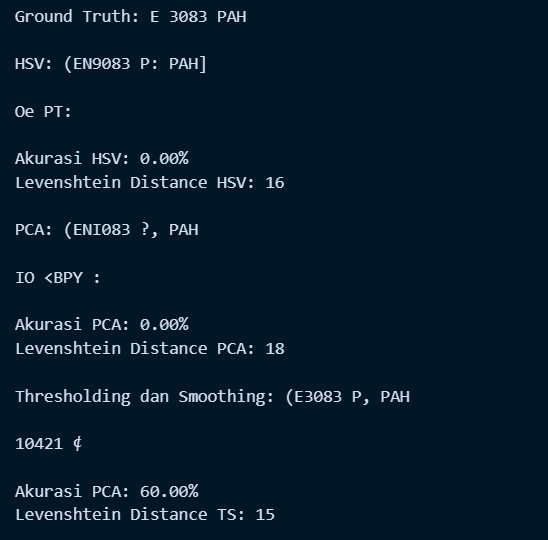

# UTS Machine Learning - Kelompok 1

**Anggota Kelompok :** 

1. 2141720185 - Adam Rafi Rezandi
2. 2141720003 - Tio Misbaqul Irawan
3. 2141720019 - Bima Bayu Saputra
4. 2141720036 - Lailatul Badriyah
5. 2141720046 - Andi Dwi Prastyo

## Ketentuan UTS

Berdasarkan pemaparan kasus, Anda diminta untuk,

1. Pilih 5 citra plat nomor untuk setiap anggota kelompok dari dataset yang telah disediakan. DOWNLOAD
2. Lakukan segmentasi pada citra plat nomor untuk memperjelas karakter pada plat nomor.
3. Anda dapat menggunakan algortima K-Means seperti yang telah dijelaskan pada praktikum sebelumnya atau menggunakan algoritma klasterisasi yang lain.
4. Anda diperkenankan untuk melakukan pra pengolahan data (preprocessing) pada citra seperti,
	- Merubah color space
	- Reduksi dimensi
	- dsb
5. Tampilkan perbandingan citra antara sebelum dan sesudah di segmentasi

**Catatan:**

- Proses loading citra dicontohkan dengan menggunakan library openCV
- Secara default, openCV akan memuat citra dalam format BGR

## Hasil Segmentasi dari Berbagai Plat Nomer - Bima Bayu Saputra

**Citra Plat Original:**


Menggunakan 3 jenis preprocessing yang berbeda yaitu:

- Mengubah color space menjadi HSV
- Mereduksi citra menggunakan PCA
- Menggunakan Gaussian Blur dan Thresholding

### Mengubah color space menjadi HSV

```python
# Konversi ke ruang warna HSV
hsv_images = [cv2.cvtColor(img, cv2.COLOR_RGB2HSV) for img in original_images]
```

#### Hasil Preprossesing HSV


### Mereduksi citra menggunakan PCA

```python
# Reduksi dimensi menggunakan PCA
pca = PCA(n_components=3)
reduced_images = [pca.fit_transform(img.reshape((-1, 3))).reshape(img.shape) for img in original_images]
```

#### Hasil Preprossesing PCA


### Menggunakan Gaussian Blur dan Thresholding

```python
# Mengubah citra ke grayscale
gray_images = [cv2.cvtColor(img, cv2.COLOR_RGB2GRAY) for img in original_images]
# Kombinasi Thresholding dan Smoothing pada saluran kecerahan
preprocessed_images = [cv2.threshold(cv2.GaussianBlur(img, (5, 5), 0), 0, 255, cv2.THRESH_BINARY + cv2.THRESH_OTSU)[1] for img in gray_images]
```

#### Hasil Preprossesing Gaussian Blur dan Thresholding


### Melakukan Segmentasi dengan K-Means

```python
# K-Means untuk citra rgb
def kmeans_segmentation_color(image, k):
    # Ubah citra menjadi array 2D
    pixels = image.reshape(-1, 3).astype(np.float32)
    # Normalisasi nilai piksel
    pixels /= 255.0
    # Inisialisasi K-Means dengan k cluster
    kmeans = KMeans(n_clusters=k, n_init=100, random_state=0)
    kmeans.fit(pixels)
    # Prediksi label setiap piksel
    labels = kmeans.predict(pixels)
    # Rekonstruksi citra hasil segmentasi
    segmented_image = kmeans.cluster_centers_[labels].reshape(image.shape)
    # Kembalikan citra hasil segmentasi
    segmented_image = (segmented_image * 255).astype(np.uint8)
    return segmented_image

# K-Means untuk citra grayscale
def kmeans_segmentation_gray(image, k):
    # Ubah citra grayscale menjadi array 2D
    pixels = image.reshape(-1, 1).astype(np.float32)
    # Inisialisasi K-Means dengan k cluster
    kmeans = KMeans(n_clusters=k, n_init=100, random_state=0)
    kmeans.fit(pixels)
    # Prediksi label setiap piksel
    labels = kmeans.predict(pixels)
    # Rekonstruksi citra hasil segmentasi
    segmented_image = kmeans.cluster_centers_[labels].reshape(image.shape)
    # Kembalikan citra hasil segmentasi
    return segmented_image
```

```python
# Lakukan segmentasi pada citra-citra yang telah di-preprocess
segmented_images_hsv = [kmeans_segmentation_color(img, 2) for img in hsv_images]
# Lakukan segmentasi pada citra-citra yang telah di-preprocess
segmented_images_pca = [kmeans_segmentation_color(img, 2) for img in reduced_images]
# Lakukan segmentasi pada citra-citra yang telah di-preprocess
segmented_images_ts = [kmeans_segmentation_gray(img, 2) for img in preprocessed_images]
```

### Perbandingan Plat Asli dan Hasil Segementasi


### Melakukan Evaluasi (Challenge )

```python
# Fungsi untuk menghitung akurasi pengenalan karakter
def calculate_accuracy(ground_truth, recognized_text):
    correct_characters = sum(1 for gt_char, rec_char in zip(ground_truth, recognized_text) if gt_char == rec_char)
    total_characters = len(ground_truth)
    accuracy = correct_characters / total_characters * 100.0
    return accuracy

# Fungsi untuk menghitung Levenshtein distance
def calculate_levenshtein_distance(ground_truth, recognized_text):
    return lev_distance(ground_truth, recognized_text)
```

#### Hasil Evaluasi Dengan Plat 'E 5234 YF'


#### Hasil Evaluasi Dengan Plat 'E 5234 YF'


#### Hasil Evaluasi Dengan Plat 'E 3083 PAH'





## Segmentasi dari Berbagai Plat Nomer - Lailatul Badriyah

### Menampilkan Citra Plat Nomor


### Melihat Dimensi Citra Pertama


### Normalisasi Data Citra Pertama


### Plot Distribusi Warna Piksel-Piksel dalam Citra


### Segmentasi Citra Menggunakan Algoritma K-Means


### Konversi Hasil Segmentasi K-Means Ke Biner Image


Untuk empat gambar lainnya, prosesnya sama seperti di atas. Berikut saya sertakan hasil segmentasinya:

### Citra ke-2


### Citra ke-3


### Citra ke-4


### Citra ke-5


